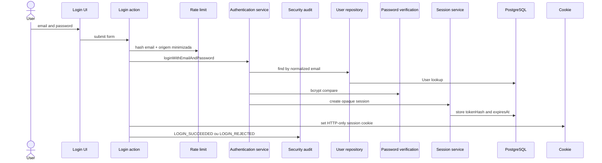
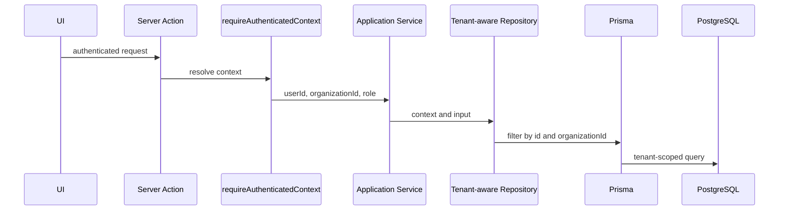
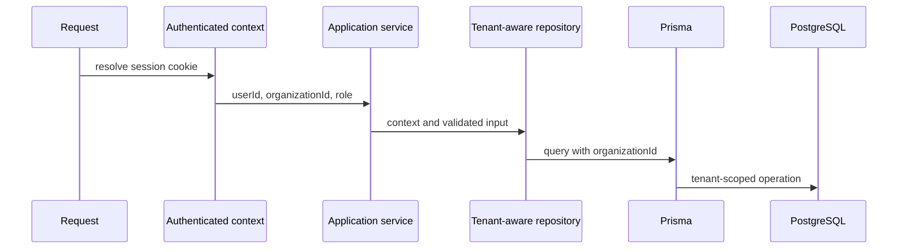
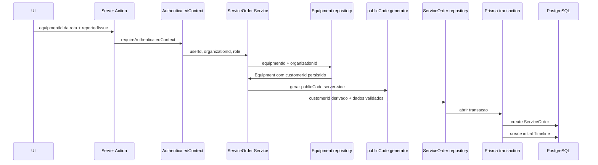
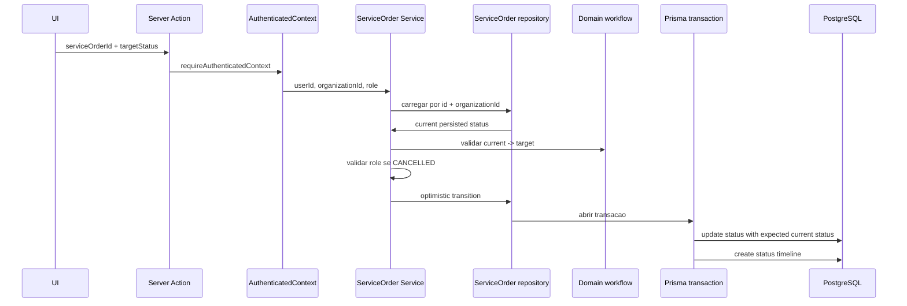
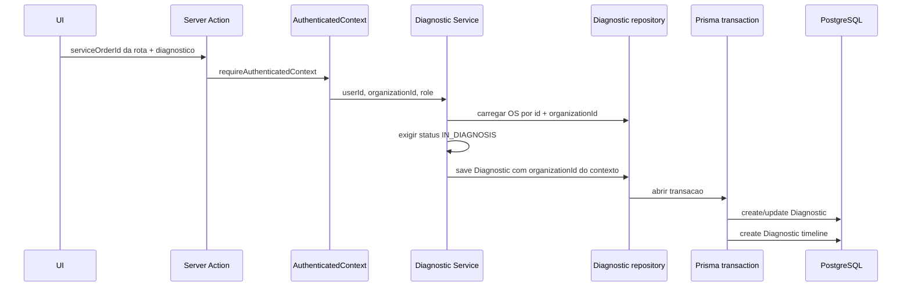
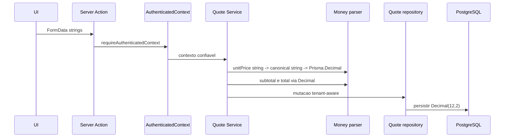
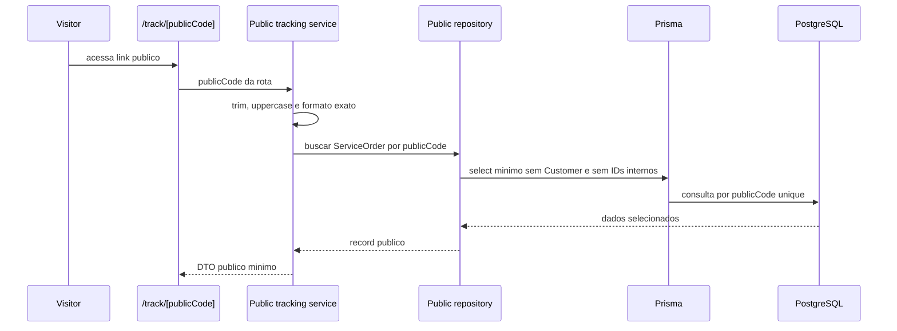
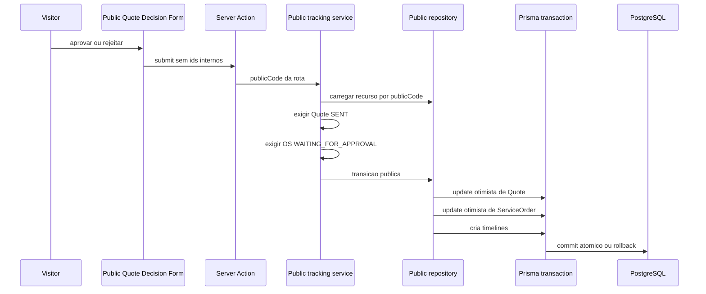

# Architecture

## Visao arquitetural

FixFlow usa uma arquitetura simples em camadas, adequada para evolucao gradual.
O projeto nao afirma seguir Clean Architecture, DDD completo ou arquitetura
hexagonal completa. A implementacao inicial separa interface, dominio e acesso a
dados sem criar abstracoes prematuras.

## Responsabilidades das camadas

- `src/app`: rotas, paginas, layouts e handlers HTTP do Next.js.
- `src/components`: componentes React de apresentacao.
- `src/lib`: configuracoes e utilitarios compartilhados.
- `src/domain/entities`: tipos e conceitos centrais do dominio.
- `src/domain/services`: regras de negocio puras e testaveis.
- `src/domain/errors`: erros de dominio.
- `src/server/auth`: hashing de senha, login, sessao, cookie, contexto
  autenticado e autorizacao por role.
- `src/server/db`: Prisma Client centralizado.
- `src/server/repositories`: contexto, repositories de autenticacao e
  repositories de acesso a dados futuros.
- `src/server/security`: cabecalhos HTTP, rate limiting, auditoria de
  seguranca, hashing de identificadores sensiveis e validacao de configuracao.
- `prisma`: schema, enums, relacionamentos e migrations.
- `docs`: decisoes tecnicas e regras que precisam sobreviver entre tarefas.

## Fluxo conceitual de uma requisicao

1. Uma rota do App Router recebe a requisicao.
2. A rota valida entradas e, quando necessario, chama
   `requireAuthenticatedContext()` ou `requireCurrentUser()`.
3. A camada de aplicacao ou service executa regras de negocio.
4. Repositories futuros consultam o banco usando Prisma e o contexto do tenant.
5. A rota retorna uma resposta HTTP adequada.

`GET /api/health` nao consulta o banco. `GET /api/me` e uma rota autenticada e
resolve o usuario atual no servidor.

O portal publico fica em `/track/[publicCode]`. Ele nao usa o layout protegido
de `/app`, nao chama `requireAuthenticatedContext()` e nao mostra navegacao
administrativa. O acesso publico e limitado a uma unica ServiceOrder carregada
por `publicCode` validado.

## Autenticacao e sessao

A Fase 2 implementa autenticacao propria e limitada ao escopo atual:

- `src/app/login`: pagina e Server Action de login.
- `src/app/app`: pagina interna protegida e Server Action de logout.
- `src/app/api/me`: endpoint autenticado de usuario atual.
- `src/server/auth/login-service.ts`: valida entrada, normaliza email, verifica
  senha e cria sessao.
- `src/server/auth/password.ts`: hash e verificacao com `bcryptjs` cost 12.
- `src/server/auth/session-service.ts`: cria, localiza, expira e invalida
  sessoes.
- `src/server/auth/session-token.ts`: gera token opaco com Node crypto e
  calcula SHA-256 para persistencia.
- `src/server/auth/session-cookie.ts`: centraliza nome, duracao e opcoes do
  cookie.
- `src/server/auth/authenticated-context.ts`: resolve User, Organization e role
  a partir do cookie de sessao.
- `src/server/auth/authorization.ts`: base pequena de autorizacao por role.
- `src/server/security/rate-limit-service.ts`: aplica rate limit antes de
  operacoes sensiveis.
- `src/server/security/security-audit-service.ts`: registra eventos de
  seguranca sem secrets ou identificadores brutos.
- `src/server/security/http-security-headers.ts`: define headers HTTP e CSP
  consumidos pelo `next.config.ts`.

Fluxo de login:



Fluxo de uma operacao autenticada futura:



Fluxo concreto implementado na Fase 3:



Na criacao de Equipment, o service valida primeiro o `customerId` usando
`customerId + context.organizationId`. Somente depois cria o Equipment com
`organizationId` vindo do contexto autenticado.

Fluxo concreto de criacao de ServiceOrder implementado na Fase 4:



Fluxo concreto de transicao de ServiceOrder:



Fluxo concreto de Diagnostic implementado na Fase 5:



Fluxo concreto de Quote DRAFT e calculo monetario:



Fluxos comerciais de Quote coordenam Quote, ServiceOrder e timeline na mesma
transacao. Envio altera Quote `DRAFT -> SENT` e ServiceOrder
`IN_DIAGNOSIS -> WAITING_FOR_APPROVAL`. Aprovacao altera Quote
`SENT -> APPROVED` e ServiceOrder `WAITING_FOR_APPROVAL -> APPROVED`. Rejeicao
altera Quote `SENT -> REJECTED` e ServiceOrder
`WAITING_FOR_APPROVAL -> CANCELLED`.

Fluxo publico de acompanhamento implementado na Fase 6:



Na Fase 8.1, a rota publica consome rate limit antes da consulta por
`publicCode`. O codigo publico nao e armazenado bruto em chaves ou auditoria; a
aplicacao usa hash do codigo normalizado quando ele e valido e hash generico
para entradas invalidas.

Fluxo publico de decisao de Quote:



## Acesso a dados

O Prisma Client fica centralizado em `src/server/db/prisma.ts`. O arquivo evita
criar multiplas instancias durante hot reload em desenvolvimento.

Chamadas diretas ao Prisma nao devem ser espalhadas pela aplicacao. Conforme os
casos de uso forem criados, o acesso deve passar por repositories ou modulos de
server code com responsabilidade clara.

Os repositories de autenticacao atuais sao pequenos e concretos:

- `auth-user-repository`: busca User por email normalizado, por id e com
  Organization para DTOs seguros.
- `auth-session-repository`: cria, localiza e remove AuthSession.

Os repositories de negocio implementados na Fase 3 tambem sao pequenos e
concretos e foram ampliados na Fase 4:

- `customer-repository`: listagem, contagem, busca por id, criacao e atualizacao
  tenant-aware de Customer.
- `equipment-repository`: listagem, contagem, busca por Customer, busca por id,
  criacao e atualizacao tenant-aware de Equipment.
- `service-order-repository`: listagem, contagem, detalhes com timeline,
  criacao de OS com timeline inicial e transicao de status com concorrencia
  otimista.
- `diagnostic-repository`: leitura e save tenant-aware de Diagnostic com
  timeline atomica.
- `quote-repository`: leitura de Quote, criacao de DRAFT, mutacoes de itens e
  transicoes comerciais atomicas com ServiceOrder.
- `public-service-order-repository`: consulta publica por `publicCode` com
  select minimo e decisao publica de Quote com updates otimistas em transacao.
- `rate-limit-repository`: contador de janelas fixas por operacao e `keyHash`.
- `security-audit-repository`: escrita de eventos de seguranca minimizados.

Eles exigem `TenantContext` e nao oferecem APIs de busca por Customer ou
Equipment usando apenas o ID da entidade. O repository de ServiceOrder tambem
nao oferece busca interna por OS usando apenas o ID da entidade.

## Fronteiras server-side

Codigo que acessa Prisma, cookies, sessoes, password hashing e repositories
fica em `src/server` ou em Server Actions/Route Handlers do App Router. Client
Components nao importam Prisma nem repositories diretamente. A excecao visual e
o formulario de login, que importa uma Server Action; o Next.js trata essa
importacao como chamada server-side, nao como acesso direto ao banco no client.

O portal publico tambem respeita essa fronteira: a pagina server-side recebe o
DTO publico, e o unico Client Component e o formulario de decisao. As Server
Actions publicas nao aceitam `organizationId`, `serviceOrderId`, `quoteId`,
status atual ou total vindos do browser.

Rate limiting e auditoria tambem permanecem server-side. Client Components nao
recebem store de rate limit, chaves, hashes de origem ou registros de auditoria.

## Regras de dominio

Regras de negocio devem ficar fora de componentes React. Nesta fase existem
regras iniciais para:

- formato de `publicCode` de ordem de servico;
- transicoes permitidas no workflow de ordem de servico.
- labels e descricoes server-side de timeline para ServiceOrder;
- validacao de `reportedIssue` e de status de ServiceOrder.
- validacao de Diagnostic;
- validacao de QuoteItem, quantity e dinheiro;
- workflow pequeno de QuoteStatus;
- calculos monetarios com `Prisma.Decimal`.

Essas regras sao testadas sem depender da interface.

O workflow de ServiceOrder permanece pequeno e explicito. Ele nao usa engine de
workflow, event sourcing ou CQRS. A regra estrutural ainda conhece as transicoes
principais, mas a application layer bloqueia os caminhos genericos que agora
pertencem a Quote: `IN_DIAGNOSIS -> WAITING_FOR_APPROVAL` e
`WAITING_FOR_APPROVAL -> APPROVED`.

Valores monetarios entram por `FormData` como string, passam por parser e
validador, viram string canonica e entao `Prisma.Decimal`. Subtotal e total sao
derivados com operacoes Decimal. DTOs retornam strings canonicas, e a UI formata
BRL apenas para apresentacao.

O DTO publico de Quote segue a mesma regra: `unitPrice`, `subtotal` e `total`
sao strings canonicas calculadas server-side. A UI publica apenas formata BRL.

## Tratamento de erros

Erros de dominio usam `DomainError`. Rotas futuras devem traduzir esses erros
para respostas HTTP coerentes, sem expor detalhes internos.

`AuthenticationError` representa ausencia de autenticacao ou credenciais
invalidas. `AuthorizationError` representa usuario autenticado sem permissao
para determinada role.

## Tenant isolation

No FixFlow, um tenant representa uma assistencia tecnica. A entidade
`Organization` e o tenant porque agrupa usuarios internos, clientes,
equipamentos, ordens de servico, diagnosticos, orcamentos e timeline.

Autenticacao identifica o User. O User persistido determina a Organization. A
Organization persistida gera o `organizationId` do `AuthenticatedContext`.
Repositories e services multi-tenant devem receber esse contexto confiavel do
servidor.

O risco principal em um sistema multiempresa e vazar dados de uma Organization
para outra ao consultar registros somente pelo ID da entidade. Mesmo com IDs nao
sequenciais, confiar apenas em `customerId`, `equipmentId` ou `serviceOrderId`
nao e suficiente para isolamento logico.

Repositories e services futuros devem receber um contexto explicito:

```ts
type TenantContext = {
  organizationId: string;
};
```

Consulta incorreta:

```ts
await prisma.serviceOrder.findUnique({
  where: { id: serviceOrderId }
});
```

Consulta correta:

```ts
await prisma.serviceOrder.findFirst({
  where: {
    id: serviceOrderId,
    organizationId: context.organizationId
  }
});
```

IDs enviados pelo browser nunca substituem `context.organizationId`.
`organizationId` nao deve vir de query parameter, body, header customizado,
campo hidden, localStorage, cookie separado ou rota dinamica. Esconder registros
na UI nao e isolamento de tenant. Middleware ou protecao de rota isoladamente
tambem nao substituem filtros de tenant no acesso aos dados.

O schema inicial tambem usa chaves compostas como `[id, organizationId]` em
entidades de negocio para reduzir o risco de relacionamentos cruzados entre
tenants. Ainda assim, isso nao substitui validacao e filtros no codigo.

A defesa atual para operacoes multi-tenant tem camadas complementares:

1. a sessao identifica o User;
2. o User persistido determina a Organization;
3. `AuthenticatedContext` carrega o `organizationId` confiavel;
4. o service recebe esse contexto explicitamente;
5. o repository exige contexto;
6. a consulta inclui `organizationId`;
7. relacionamentos e constraints compostas do banco reforcam integridade quando
   existentes.

Nenhuma dessas camadas substitui as demais. A protecao de rota nao substitui o
filtro de tenant no repository, e a constraint do banco nao substitui a validacao
do `customerId` no service.

Na abertura de ServiceOrder, `customerId` nao vem do browser. O service carrega
Equipment dentro do tenant e deriva `customerId` do registro persistido. Na
transicao de status, o service carrega o status atual do banco e o repository
atualiza por `id + organizationId + status esperado`; se a contagem for zero,
o service retorna `ConflictError` e a timeline nao e criada.

Na Fase 5, Diagnostic, Quote e QuoteItem seguem a mesma regra de tenant:
consultas usam `organizationId` e ids de recurso. O browser nao envia
`organizationId`, role, status atual, subtotal, total ou descricoes de timeline.
Envio/aprovacao/rejeicao de Quote validam status esperado de Quote e
ServiceOrder na mesma transacao.

Na Fase 6, `publicCode` e uma capability URL limitada a uma ServiceOrder. Ele
permite consulta publica minima e decisao de Quote `SENT`, mas nao revela
`organizationId`, nao lista recursos e nao autoriza operacoes internas. A
consulta publica nao seleciona Customer, email, telefone, documento,
`technicalNotes` ou IDs internos no DTO. A decisao publica carrega os IDs
necessarios apenas server-side e atualiza Quote e ServiceOrder por
`organizationId` persistido e status esperado dentro da transacao.

Criacao de OS + timeline inicial e mudanca de status + timeline de status usam
transacoes Prisma especificas no repository. Nao ha UnitOfWork, Transaction
Manager ou repository generico.

Row Level Security do PostgreSQL pode ser avaliado em uma fase futura, mas nao
foi implementado nesta fase para manter o escopo controlado.

## Decisoes atuais

- Next.js App Router sera a camada web.
- PostgreSQL e o banco principal.
- Prisma e o ORM.
- `Organization` representa o tenant.
- IDs internos usam `cuid()`.
- Sessao usa token opaco bruto no cookie e somente `tokenHash` no banco.
- `AuthSession` nao possui `organizationId`; o tenant vem do User autenticado.
- A expiracao da sessao e fixa em 7 dias, sem sliding expiration nesta fase.
- `User.email` permanece unico globalmente nesta fase.
- `ServiceOrder.publicCode` e unico e nao deve ser sequencial.
- `publicCode` funciona como link publico de acompanhamento, nao como
  autenticacao administrativa.
- `ServiceOrder.customerId` e derivado do Equipment validado no tenant durante a
  criacao.
- `ServiceOrder` muda de status somente por workflow server-side.
- `Diagnostic` e unico por ServiceOrder dentro da Organization.
- `Quote` e unico por ServiceOrder dentro da Organization nesta fase.
- QuoteItems sao mutaveis somente enquanto Quote esta em `DRAFT`.
- Envio, aprovacao e rejeicao de Quote coordenam Quote, ServiceOrder e timeline
  atomicamente.
- Valores monetarios usam `Decimal @db.Decimal(12, 2)`.
- Docker Compose fornece PostgreSQL local; a app roda via npm nesta fase.
- A store em memoria de rate limit e permitida somente para desenvolvimento e
  testes. Producao deve usar PostgreSQL/Prisma.
- Auditoria de seguranca registra eventos minimizados e nao bloqueia operacoes
  legitimas quando a escrita de log falha.

## Evolucoes futuras

- autenticacao;
- contexto de Organization por request;
- repositories para novos casos de uso reais;
- politica de retencao e observabilidade de auditoria;
- controle de permissoes por papel;
- Row Level Security;
- melhorias do portal publico e envio externo do link;
- observabilidade de seguranca e alertas;
- testes de integracao com banco.
