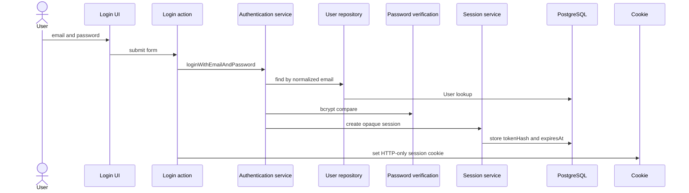
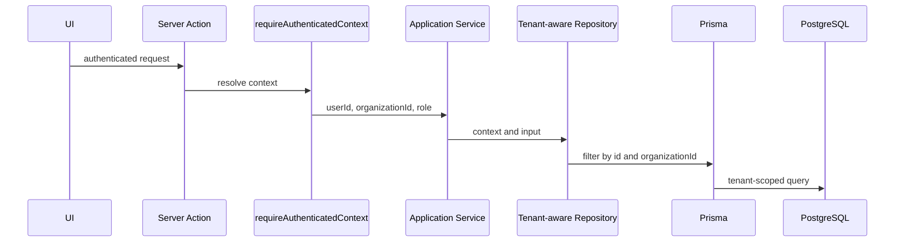

# Architecture

## Visao arquitetural

FixFlow usa uma arquitetura simples em camadas, adequada para evolucao gradual.
O projeto nao afirma seguir Clean Architecture, DDD completo ou arquitetura
hexagonal completa. A implementacao inicial separa interface, dominio e acesso a
dados sem criar abstracoes prematuras.

## Responsabilidades das camadas

- `src/app`: rotas, paginas, layouts e handlers HTTP do Next.js.
- `src/components`: componentes React de apresentacao.
- `src/lib`: configuracoes e utilitarios compartilhados.
- `src/domain/entities`: tipos e conceitos centrais do dominio.
- `src/domain/services`: regras de negocio puras e testaveis.
- `src/domain/errors`: erros de dominio.
- `src/server/auth`: hashing de senha, login, sessao, cookie, contexto
  autenticado e autorizacao por role.
- `src/server/db`: Prisma Client centralizado.
- `src/server/repositories`: contexto, repositories de autenticacao e
  repositories de acesso a dados futuros.
- `prisma`: schema, enums, relacionamentos e migrations.
- `docs`: decisoes tecnicas e regras que precisam sobreviver entre tarefas.

## Fluxo conceitual de uma requisicao

1. Uma rota do App Router recebe a requisicao.
2. A rota valida entradas e, quando necessario, chama
   `requireAuthenticatedContext()` ou `requireCurrentUser()`.
3. A camada de aplicacao ou service executa regras de negocio.
4. Repositories futuros consultam o banco usando Prisma e o contexto do tenant.
5. A rota retorna uma resposta HTTP adequada.

`GET /api/health` nao consulta o banco. `GET /api/me` e uma rota autenticada e
resolve o usuario atual no servidor.

## Autenticacao e sessao

A Fase 2 implementa autenticacao propria e limitada ao escopo atual:

- `src/app/login`: pagina e Server Action de login.
- `src/app/app`: pagina interna protegida e Server Action de logout.
- `src/app/api/me`: endpoint autenticado de usuario atual.
- `src/server/auth/login-service.ts`: valida entrada, normaliza email, verifica
  senha e cria sessao.
- `src/server/auth/password.ts`: hash e verificacao com `bcryptjs` cost 12.
- `src/server/auth/session-service.ts`: cria, localiza, expira e invalida
  sessoes.
- `src/server/auth/session-token.ts`: gera token opaco com Node crypto e
  calcula SHA-256 para persistencia.
- `src/server/auth/session-cookie.ts`: centraliza nome, duracao e opcoes do
  cookie.
- `src/server/auth/authenticated-context.ts`: resolve User, Organization e role
  a partir do cookie de sessao.
- `src/server/auth/authorization.ts`: base pequena de autorizacao por role.

Fluxo de login:



Fluxo de uma operacao autenticada futura:



## Acesso a dados

O Prisma Client fica centralizado em `src/server/db/prisma.ts`. O arquivo evita
criar multiplas instancias durante hot reload em desenvolvimento.

Chamadas diretas ao Prisma nao devem ser espalhadas pela aplicacao. Conforme os
casos de uso forem criados, o acesso deve passar por repositories ou modulos de
server code com responsabilidade clara.

Os repositories de autenticacao atuais sao pequenos e concretos:

- `auth-user-repository`: busca User por email normalizado, por id e com
  Organization para DTOs seguros.
- `auth-session-repository`: cria, localiza e remove AuthSession.

## Fronteiras server-side

Codigo que acessa Prisma, cookies, sessoes, password hashing e repositories
fica em `src/server` ou em Server Actions/Route Handlers do App Router. Client
Components nao importam Prisma nem repositories diretamente. A excecao visual e
o formulario de login, que importa uma Server Action; o Next.js trata essa
importacao como chamada server-side, nao como acesso direto ao banco no client.

## Regras de dominio

Regras de negocio devem ficar fora de componentes React. Nesta fase existem
regras iniciais para:

- formato de `publicCode` de ordem de servico;
- transicoes permitidas no workflow de ordem de servico.

Essas regras sao testadas sem depender da interface.

## Tratamento de erros

Erros de dominio usam `DomainError`. Rotas futuras devem traduzir esses erros
para respostas HTTP coerentes, sem expor detalhes internos.

`AuthenticationError` representa ausencia de autenticacao ou credenciais
invalidas. `AuthorizationError` representa usuario autenticado sem permissao
para determinada role.

## Tenant isolation

No FixFlow, um tenant representa uma assistencia tecnica. A entidade
`Organization` e o tenant porque agrupa usuarios internos, clientes,
equipamentos, ordens de servico, diagnosticos, orcamentos e timeline.

Autenticacao identifica o User. O User persistido determina a Organization. A
Organization persistida gera o `organizationId` do `AuthenticatedContext`.
Repositories e services multi-tenant devem receber esse contexto confiavel do
servidor.

O risco principal em um sistema multiempresa e vazar dados de uma Organization
para outra ao consultar registros somente pelo ID da entidade. Mesmo com IDs nao
sequenciais, confiar apenas em `customerId`, `equipmentId` ou `serviceOrderId`
nao e suficiente para isolamento logico.

Repositories e services futuros devem receber um contexto explicito:

```ts
type TenantContext = {
  organizationId: string;
};
```

Consulta incorreta:

```ts
await prisma.serviceOrder.findUnique({
  where: { id: serviceOrderId }
});
```

Consulta correta:

```ts
await prisma.serviceOrder.findFirst({
  where: {
    id: serviceOrderId,
    organizationId: context.organizationId
  }
});
```

IDs enviados pelo browser nunca substituem `context.organizationId`.
`organizationId` nao deve vir de query parameter, body, header customizado,
campo hidden, localStorage, cookie separado ou rota dinamica. Esconder registros
na UI nao e isolamento de tenant. Middleware ou protecao de rota isoladamente
tambem nao substituem filtros de tenant no acesso aos dados.

O schema inicial tambem usa chaves compostas como `[id, organizationId]` em
entidades de negocio para reduzir o risco de relacionamentos cruzados entre
tenants. Ainda assim, isso nao substitui validacao e filtros no codigo.

Row Level Security do PostgreSQL pode ser avaliado em uma fase futura, mas nao
foi implementado nesta fase para manter o escopo controlado.

## Decisoes atuais

- Next.js App Router sera a camada web.
- PostgreSQL e o banco principal.
- Prisma e o ORM.
- `Organization` representa o tenant.
- IDs internos usam `cuid()`.
- Sessao usa token opaco bruto no cookie e somente `tokenHash` no banco.
- `AuthSession` nao possui `organizationId`; o tenant vem do User autenticado.
- A expiracao da sessao e fixa em 7 dias, sem sliding expiration nesta fase.
- `User.email` permanece unico globalmente nesta fase.
- `ServiceOrder.publicCode` e unico e nao deve ser sequencial.
- Valores monetarios usam `Decimal @db.Decimal(12, 2)`.
- Docker Compose fornece PostgreSQL local; a app roda via npm nesta fase.

## Evolucoes futuras

- autenticacao;
- contexto de Organization por request;
- repositories para casos de uso reais;
- auditoria de eventos;
- controle de permissoes por papel;
- Row Level Security;
- portal publico da ordem de servico;
- testes de integracao com banco.
