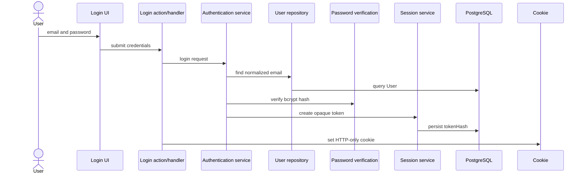
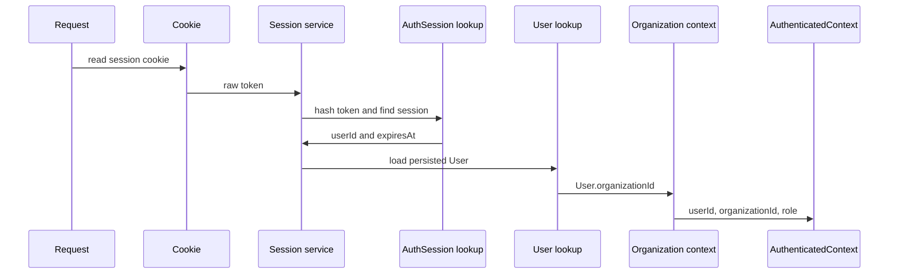

# Authentication

## Objetivo

A autenticacao atual cria uma fronteira server-side para usuarios internos do
FixFlow. O objetivo da Fase 2 e permitir login por email e senha, persistir
sessoes opacas no PostgreSQL e construir um contexto confiavel de Organization
para as proximas funcionalidades.

Esta implementacao nao e apresentada como recomendacao universal para todos os
sistemas de producao. Ela e uma base explicita para demonstrar o fluxo de
autenticacao, sessao persistida e isolamento de tenant no projeto.

## Login por email e senha

O login recebe email e senha em `/login`. A Server Action valida os campos,
normaliza o email e delega a regra para `loginWithEmailAndPassword`.

Credenciais invalidas retornam uma mensagem generica: `Email ou senha invalidos.`
O sistema nao informa se o email existe ou se somente a senha esta incorreta.

## Normalizacao de email

A normalizacao fica em `normalizeEmail` e aplica:

- `trim`;
- `lowercase`.

A mesma estrategia e usada no login e no bootstrap de desenvolvimento. Nesta
fase, `User.email` permanece unico globalmente; portanto, o mesmo email nao pode
representar usuarios diferentes em Organizations distintas.

## Password hashing

Senhas sao validadas com minimo de 12 e maximo de 64 caracteres. A validacao
tambem rejeita entradas que `bcryptjs.truncates` informa que seriam truncadas
pelo limite efetivo do bcrypt. Isso evita que duas senhas distintas sejam
silenciosamente tratadas como equivalentes antes do hash, especialmente quando
caracteres UTF-8 ocupam mais de um byte.

Politicas mais sofisticadas podem evoluir futuramente, mas a implementacao
atual nao exige simbolo, numero ou letra maiuscula.

O hash usa `bcryptjs` com cost factor 12. A senha bruta nao e armazenada, nao e
logada e nao aparece em DTOs. O hash reduz o risco em caso de vazamento, mas nao
torna senhas impossiveis de quebrar.

## Sessao opaca

Ao autenticar com sucesso, o servidor gera um token aleatorio com Node crypto. O
token bruto e serializado para o cookie e nao e persistido no banco.

Antes de persistir, o servidor calcula `tokenHash` com SHA-256. A tabela
`AuthSession` guarda:

- `id`;
- `userId`;
- `tokenHash`;
- `expiresAt`;
- timestamps.

`tokenHash` e unico. A constraint unique ja fornece indice para busca por hash,
entao nao ha indice redundante para esse campo.

## Cookie

O cookie de sessao usa nome especifico do FixFlow e configuracao centralizada:

- `httpOnly: true`;
- `sameSite: "lax"`;
- `path: "/"`;
- `secure: true` em producao;
- duracao de 7 dias.

O token nao fica disponivel para JavaScript client-side e nao e exposto em URL
ou JSON. Cookies nao sao invulneraveis; por isso as proximas fases ainda podem
evoluir controles como rate limiting, auditoria e politicas adicionais.

## Expiracao e logout

A expiracao e fixa em 7 dias a partir da criacao da sessao. Nao ha sliding
expiration nesta fase.

Ao localizar uma sessao expirada, o service a remove quando isso e simples e
seguro. O logout invalida a sessao no banco usando o hash derivado do token
bruto e depois limpa o cookie. Remover apenas o cookie nao e considerado logout
suficiente.

## AuthenticatedContext

`AuthenticatedContext` contem:

- `userId`;
- `organizationId`;
- `role`.

O `organizationId` confiavel vem do User persistido no banco:

1. o servidor le o cookie de sessao;
2. calcula `tokenHash`;
3. localiza `AuthSession`;
4. valida `expiresAt`;
5. carrega o User;
6. usa `User.organizationId` e `User.role`;
7. constroi `AuthenticatedContext`.

`organizationId` nao vem de query string, body, header do browser, campo hidden,
localStorage, rota dinamica ou cookie separado controlado pelo cliente.

## Role authorization

A base de autorizacao usa `UserRole` com os valores existentes:

- `OWNER`;
- `ADMIN`;
- `TECHNICIAN`.

`hasRole` verifica se a role atual esta na lista permitida. `requireRole` lanca
`AuthorizationError` quando o usuario esta autenticado, mas nao possui permissao.
Isso e diferente de `AuthenticationError`, usado para ausencia de autenticacao
ou credenciais invalidas.

## Bootstrap de desenvolvimento

O comando `npm run db:seed` usa variaveis `FIXFLOW_BOOTSTRAP_*` para criar ou
atualizar uma Organization e um usuario OWNER de desenvolvimento. A senha nao
tem valor padrao no codigo e passa pelo mesmo `hashPassword` usado pela
autenticacao.

Se o email informado ja existir, o script atualiza esse usuario e o associa a
Organization configurada. Esse comportamento e intencionalmente limitado ao
bootstrap de desenvolvimento e nao representa gerenciamento de usuarios pela
interface.

## Diagramas

Login:

Resolucao de contexto autenticado:

## Ameacas consideradas

- senha bruta nao deve ser persistida;
- hash de senha nao deve chegar ao browser;
- token bruto nao deve ser persistido no banco;
- `tokenHash` nao deve chegar ao browser;
- login nao deve revelar existencia do usuario;
- `organizationId` e role nao devem vir do cliente;
- `/app` e `/api/me` devem resolver autenticacao no servidor;
- logout deve invalidar sessao server-side.

## Limitacoes atuais

- nao ha rate limiting no login;
- nao ha recuperacao ou redefinicao de senha;
- nao ha verificacao de email;
- nao ha MFA;
- nao ha sliding expiration;
- nao ha job periodico para limpeza de sessoes expiradas;
- nao ha gerenciamento de usuarios pela interface;
- nao ha suporte a usuario em multiplas Organizations.

Esses pontos sao riscos ou evolucoes futuras, nao funcionalidades simuladas na
Fase 2.
