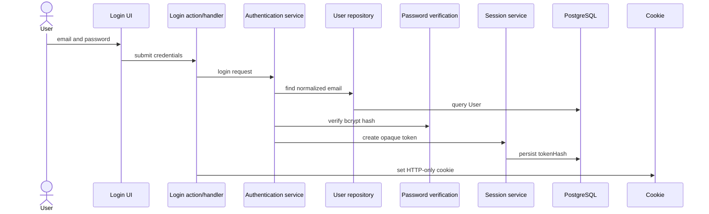
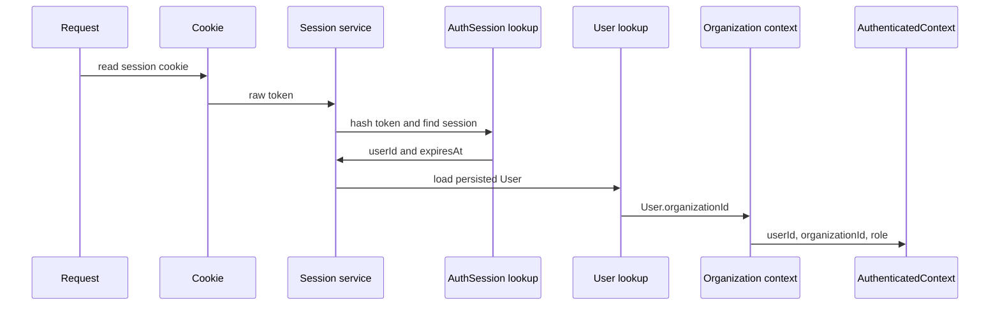

# Authentication

## Objetivo

A autenticacao atual cria uma fronteira server-side para usuarios internos do
FixFlow. A Fase 2 implementou login e sessoes opacas. A Fase 8.2A adicionou
gestao de usuarios, convites manuais, desativacao e revogacao de sessoes. A
Fase 8.2B adiciona troca autenticada de senha e redefinicao assistida por OWNER.

Esta implementacao nao e apresentada como recomendacao universal para todos os
sistemas de producao. Ela e uma base explicita para demonstrar o fluxo de
autenticacao, sessao persistida e isolamento de tenant no projeto.

## Login por email e senha

O login recebe email e senha em `/login`. A Server Action valida os campos,
normaliza o email e delega a regra para `loginWithEmailAndPassword`.

Credenciais invalidas retornam uma mensagem generica: `Email ou senha invalidos.`
O sistema nao informa se o email existe ou se somente a senha esta incorreta.
Usuarios desativados e convidados que ainda nao definiram senha recebem a mesma
mensagem generica e nenhuma sessao e criada.

Antes da verificacao de credenciais, a Server Action de login aplica rate
limiting com hash do email normalizado e hash da origem minimizada. A senha nunca
participa da chave de rate limit. Tentativas recusadas por credenciais invalidas
e logins bem-sucedidos sao registrados na auditoria de seguranca sem senha,
hash de senha, cookie ou token de sessao.

## Normalizacao de email

A normalizacao fica em `normalizeEmail` e aplica:

- `trim`;
- `lowercase`.

A mesma estrategia e usada no login e no bootstrap de desenvolvimento. Nesta
fase, `User.email` permanece unico globalmente; portanto, o mesmo email nao pode
representar usuarios diferentes em Organizations distintas.

## Password hashing

Senhas sao validadas com minimo de 12 e maximo de 64 caracteres. A validacao
tambem rejeita entradas que `bcryptjs.truncates` informa que seriam truncadas
pelo limite efetivo do bcrypt. Isso evita que duas senhas distintas sejam
silenciosamente tratadas como equivalentes antes do hash, especialmente quando
caracteres UTF-8 ocupam mais de um byte.

Politicas mais sofisticadas podem evoluir futuramente, mas a implementacao
atual nao exige simbolo, numero ou letra maiuscula.

O hash usa `bcryptjs` com cost factor 12. A senha bruta nao e armazenada, nao e
logada e nao aparece em DTOs. O hash reduz o risco em caso de vazamento, mas nao
torna senhas impossiveis de quebrar.

## Sessao opaca

Ao autenticar com sucesso, o servidor gera um token aleatorio com Node crypto. O
token bruto e serializado para o cookie e nao e persistido no banco.

Antes de persistir, o servidor calcula `tokenHash` com SHA-256. A tabela
`AuthSession` guarda:

- `id`;
- `userId`;
- `tokenHash`;
- `expiresAt`;
- timestamps.

`tokenHash` e unico. A constraint unique ja fornece indice para busca por hash,
entao nao ha indice redundante para esse campo.

## Cookie

O cookie de sessao usa nome especifico do FixFlow e configuracao centralizada:

- `httpOnly: true`;
- `sameSite: "lax"`;
- `path: "/"`;
- `secure: true` em producao;
- duracao de 7 dias.

O token nao fica disponivel para JavaScript client-side e nao e exposto em URL
ou JSON. Cookies nao sao invulneraveis; por isso as proximas fases ainda podem
evoluir controles como rate limiting, auditoria e politicas adicionais.

## Expiracao e logout

A expiracao e fixa em 7 dias a partir da criacao da sessao. Nao ha sliding
expiration nesta fase.

Ao localizar uma sessao expirada, o service a remove quando isso e simples e
seguro. O logout invalida a sessao no banco usando o hash derivado do token
bruto e depois limpa o cookie. Remover apenas o cookie nao e considerado logout
suficiente.

OWNER pode revogar todas as sessoes de um User da propria Organization. A
desativacao do User e a remocao de todas as suas sessoes ocorrem na mesma
transacao. A aplicacao usa exclusao das linhas de `AuthSession` como revogacao;
nao existe flag de revogacao separada nesta fase.

O logout registra evento de auditoria com `userId` e `organizationId` quando a
sessao ainda pode ser resolvida antes da invalidacao. O token bruto do cookie
nao e registrado.

## AuthenticatedContext

`AuthenticatedContext` contem:

- `userId`;
- `organizationId`;
- `role`.

O `organizationId` confiavel vem do User persistido no banco:

1. o servidor le o cookie de sessao;
2. calcula `tokenHash`;
3. localiza `AuthSession`;
4. valida `expiresAt`;
5. carrega o User;
6. exige `disabledAt = null` e `passwordHash` preenchido;
7. confirma a relacao com uma Organization persistida;
8. usa `User.organizationId` e `User.role`;
9. constroi `AuthenticatedContext`.

`organizationId` nao vem de query string, body, header do browser, campo hidden,
localStorage, rota dinamica ou cookie separado controlado pelo cliente.

## Role authorization

A base de autorizacao usa `UserRole` com os valores existentes:

- `OWNER`;
- `ADMIN`;
- `TECHNICIAN`.

`hasRole` verifica se a role atual esta na lista permitida. `requireRole` lanca
`AuthorizationError` quando o usuario esta autenticado, mas nao possui permissao.
Isso e diferente de `AuthenticationError`, usado para ausencia de autenticacao
ou credenciais invalidas.

Na gestao de usuarios da Fase 8.2A:

- somente OWNER lista ou altera usuarios;
- ADMIN e TECHNICIAN sao recusados novamente no service e na Server Action;
- OWNER nao altera a propria role;
- OWNER nao desativa a propria conta;
- o ultimo OWNER ativo nao pode ser desativado ou rebaixado;
- todos os IDs de User sao combinados com o `organizationId` autenticado.

## Convite e configuracao de conta

OWNER cria o convite em `/app/settings/users` informando nome, email e role. O
email continua unico globalmente. O User e criado com `passwordHash = null`;
nenhuma senha temporaria e gerada.

O token de configuracao:

- possui 32 bytes aleatorios e codificacao Base64URL;
- e mostrado somente no retorno da criacao ou reemissao;
- e persistido apenas como SHA-256 em `UserInvitation.tokenHash`;
- expira em 72 horas;
- pode ser revogado;
- funciona uma unica vez.

O OWNER copia e compartilha o link manualmente. Nao existe envio de email nesta
fase. Convite expirado ou revogado pode ser reemitido; isso gera token novo e
invalida o anterior.

Em `/setup-account/[token]`, o convidado define e confirma a propria senha. A
senha usa a mesma politica e o mesmo bcrypt cost 12 do login. A pagina e a
Server Action aplicam rate limit por origem. Token invalido, expirado, revogado,
utilizado ou associado a User desativado produz a mesma mensagem generica.

O consumo usa update condicional por `tokenHash`, `usedAt`, `revokedAt` e
`expiresAt`. Marcar `usedAt` e preencher `User.passwordHash` ocorrem na mesma
transacao. Depois do sucesso, o usuario faz login normalmente; nao ha login
automatico pelo link.

Convites encerrados podem ser removidos pelo cleanup de retencao. Enquanto o
User continuar convidado, um OWNER ainda pode reemitir o convite: o repository
recria `UserInvitation` no mesmo tenant quando o registro antigo ja nao existe.

## Alteracao autenticada da propria senha

OWNER, ADMIN e TECHNICIAN autenticados acessam `/app/settings/account`. O
formulario exige senha atual, nova senha e confirmacao. A nova senha passa pela
mesma politica do cadastro, deve coincidir com a confirmacao e nao pode ser
equivalente a senha atual.

A Server Action resolve `AuthenticatedContext`, aplica rate limit usando hashes
do tenant, User e origem, e nunca aceita `organizationId` do formulario. O
service carrega a credencial ativa por `userId + organizationId`, verifica a
senha atual com bcrypt e calcula o novo hash.

A atualizacao condicional de `User.passwordHash` e a exclusao de todas as
`AuthSession` do User ocorrem na mesma transacao. Isso inclui a sessao corrente;
depois do commit, a action tambem expira o cookie local e orienta um novo login.
Falhas de senha atual ou estado concorrente usam resposta generica e nao
revelam hash ou detalhe de conta.

## Redefinicao assistida por OWNER

Nao existe solicitacao autonoma por email. Um OWNER autenticado seleciona um
User ativo da propria Organization em `/app/settings/users` e gera um link
manual. Contas convidadas, desativadas, inexistentes ou de outro tenant nao
recebem token.

O token:

- possui 32 bytes aleatorios codificados em Base64URL;
- aparece somente na resposta da criacao;
- e armazenado apenas como SHA-256 em `PasswordResetToken.tokenHash`;
- expira conforme `FIXFLOW_PASSWORD_RESET_TOKEN_TTL_MINUTES`, com padrao local
  de 30 minutos;
- pode ser revogado pelo OWNER;
- funciona uma unica vez.

A criacao bloqueia a linha do User dentro da transacao, revalida tenant e
estado ativo, revoga tokens pendentes anteriores e cria o novo registro. A
constraint parcial do PostgreSQL impede mais de um token pendente por
`organizationId + userId`.

O destinatario abre `/reset-password/[token]`, sem `AuthenticatedContext`, e
informa a nova senha. Token invalido, expirado, usado, revogado ou associado a
conta indisponivel produz a mesma resposta. O consumo faz claim condicional do
token; somente a transacao que altera uma linha pode atualizar a senha. O mesmo
commit revoga todas as sessoes e qualquer outro token pendente do User. Nao ha
login automatico.

Criacao, revogacao, conclusao, rejeicoes e bloqueios de rate limit sao
auditados com hashes minimizados. Token bruto, link completo e senha nunca
entram na auditoria.

## Bootstrap de desenvolvimento

O comando `npm run db:seed` usa variaveis `FIXFLOW_BOOTSTRAP_*` para criar ou
atualizar uma Organization e um usuario OWNER de desenvolvimento. A senha nao
tem valor padrao no codigo e passa pelo mesmo `hashPassword` usado pela
autenticacao.

Se o email informado ja existir, o script atualiza esse usuario e o associa a
Organization configurada. Esse comportamento e intencionalmente limitado ao
bootstrap de desenvolvimento e nao representa gerenciamento de usuarios pela
interface.

## Diagramas

Login:

```mermaid
sequenceDiagram
  actor User
  participant LoginUI as Login UI
  participant Handler as Login action/handler
  participant Auth as Authentication service
  participant Repo as User repository
  participant Password as Password verification
  participant Session as Session service
  participant DB as PostgreSQL
  participant Cookie

  User->>LoginUI: email and password
  LoginUI->>Handler: submit credentials
  Handler->>Auth: login request
  Auth->>Repo: find normalized email
  Repo->>DB: query User
  Auth->>Password: verify bcrypt hash
  Auth->>Session: create opaque token
  Session->>DB: persist tokenHash
  Handler->>Cookie: set HTTP-only cookie
```

Resolucao de contexto autenticado:

```mermaid
sequenceDiagram
  participant Request
  participant Cookie
  participant Session as Session service
  participant Lookup as AuthSession lookup
  participant UserLookup as User lookup
  participant Org as Organization context
  participant Context as AuthenticatedContext

  Request->>Cookie: read session cookie
  Cookie->>Session: raw token
  Session->>Lookup: hash token and find session
  Lookup->>Session: userId and expiresAt
  Session->>UserLookup: load persisted User
  UserLookup->>Org: User.organizationId
  Org->>Context: userId, organizationId, role
```

## Ameacas consideradas

- senha bruta nao deve ser persistida;
- hash de senha nao deve chegar ao browser;
- token bruto nao deve ser persistido no banco;
- `tokenHash` nao deve chegar ao browser;
- login nao deve revelar existencia do usuario;
- login deve ter rate limit sem usar senha ou token em chaves;
- eventos de login e logout nao devem registrar secrets;
- token bruto de convite nao deve ser persistido, logado ou auditado;
- consumo concorrente do convite nao deve ativar duas vezes;
- token bruto de redefinicao nao deve ser persistido, logado ou auditado;
- criacao de redefinicao deve ser OWNER-only e tenant-aware;
- consumo concorrente de redefinicao deve produzir um unico vencedor;
- troca e redefinicao de senha devem revogar todas as sessoes do User;
- User desativado nao deve autenticar nem conservar acesso por sessao antiga;
- `organizationId` e role nao devem vir do cliente;
- `/app` e `/api/me` devem resolver autenticacao no servidor;
- logout deve invalidar sessao server-side.

## Limitacoes atuais

- a recuperacao e assistida por OWNER e nao possui solicitacao autonoma;
- um OWNER bloqueado precisa de outro OWNER ativo para receber o link; nao ha
  recuperacao self-service ou fluxo operacional para o unico OWNER;
- nao ha verificacao de email;
- nao ha MFA;
- nao ha sliding expiration;
- o cleanup de retencao e manual; nao ha scheduler embutido;
- nao ha suporte a usuario em multiplas Organizations.
- nao ha envio automatico de convite ou redefinicao;

Esses pontos sao riscos ou evolucoes futuras, nao funcionalidades simuladas na
versao atual.
