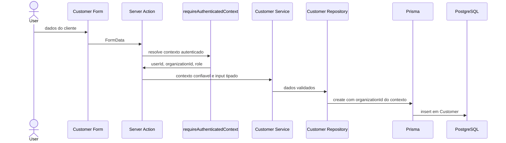
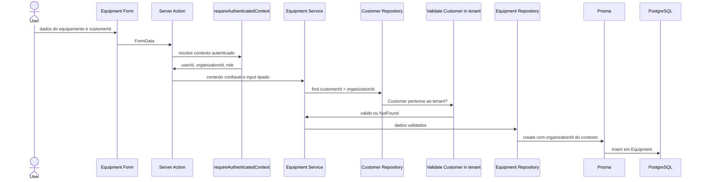

# Customer and Equipment

## Objetivo

A Fase 3 implementa o gerenciamento autenticado e multi-tenant de clientes e
equipamentos. O objetivo arquitetural e demonstrar o uso pratico de
`AuthenticatedContext` e `TenantContext` para proteger entidades de negocio por
`Organization`.

## Customer

`Customer` representa o cliente atendido pela assistencia tecnica. Nesta fase o
sistema permite listar, buscar, detalhar, criar e editar clientes da
Organization autenticada.

Campos tratados pela aplicacao:

- `name`: obrigatorio, com trim, minimo de 2 e maximo de 120 caracteres.
- `email`: opcional, com trim, normalizacao em lowercase e validacao de formato.
- `phone`: obrigatorio, com trim, minimo de 8 e maximo de 30 caracteres.
- `document`: opcional, com trim e maximo de 50 caracteres.

Campos vazios opcionais sao normalizados para ausencia de valor.

## Equipment

`Equipment` representa um equipamento pertencente a um cliente. Nesta fase o
sistema permite listar, buscar, detalhar, criar e editar equipamentos da
Organization autenticada.

Campos tratados pela aplicacao:

- `customerId`: obrigatorio na criacao e validado dentro do tenant.
- `type`: obrigatorio e restrito ao enum `NOTEBOOK`, `DESKTOP` ou `OTHER`.
- `brand`: obrigatorio, com trim e maximo de 100 caracteres.
- `model`: obrigatorio, com trim e maximo de 120 caracteres.
- `serialNumber`: opcional, com trim e maximo de 120 caracteres.
- `accessories`: opcional, com trim e maximo de 500 caracteres.
- `notes`: opcional, com trim e maximo de 2000 caracteres.

Na edicao de Equipment, `customerId` nao e editavel. Mover equipamento entre
clientes fica fora do escopo desta fase.

## Relacao Customer -> Equipment

Um Customer pode possuir varios Equipment. Ambos possuem `organizationId` para
que consultas de Equipment nao dependam apenas do relacionamento com Customer
para isolamento. O schema tambem usa relacao composta entre `customerId` e
`organizationId`, reduzindo risco de relacionamento cruzado entre tenants.

`customerId` vindo do browser e apenas um identificador de recurso. Ele nao e
contexto de tenant e nao e confiavel ate ser validado contra
`context.organizationId`.

## Paginacao e busca

As listagens usam paginacao simples por pagina com tamanho fixo de 20 registros.
O browser nao escolhe o page size.

Busca de Customer considera:

- `name`;
- `email`;
- `phone`.

Busca de Equipment considera:

- `brand`;
- `model`;
- `serialNumber`.

A busca e enviada ao banco via Prisma, sempre com filtro por `organizationId`.
Nao ha filtragem em memoria depois de carregar todos os registros.

## Services e repositories

Os services recebem `TenantContext`, validam input, chamam repositories e
retornam DTOs seguros. Eles nao leem cookies, `FormData` ou `searchParams`.

Os repositories sao concretos:

- `customer-repository`;
- `equipment-repository`.

Todos os metodos de dados multi-tenant recebem `TenantContext` e usam
`context.organizationId` no filtro ou na criacao. Nao existem metodos de busca
por Customer ou Equipment usando apenas o ID da entidade.

## DTOs

Listagens retornam somente os campos necessarios para a interface. Detalhes de
Customer incluem os equipamentos vinculados. Detalhes de Equipment incluem
dados basicos do cliente. `organizationId` nao e enviado ao browser nos DTOs
desta fase.

## Criacao de Customer

## Criacao de Equipment

## Atualizacao

Atualizacao de Customer usa a chave composta `id_organizationId`.

Atualizacao de Equipment tambem usa `id_organizationId` e atualiza apenas campos
permitidos. `customerId` e `organizationId` nao fazem parte do input de edicao.

## Politica de acesso

Nesta fase, `OWNER`, `ADMIN` e `TECHNICIAN` podem visualizar, criar e editar
Customer e Equipment. Todas as operacoes exigem autenticacao. A base de
autorizacao por role permanece disponivel para fases futuras, mas nao ha
diferenca artificial entre os papeis aqui.

## Ausencia de delete

Delete, soft delete e movimentacao de Equipment entre Customers nao foram
implementados nesta fase.

## Banco

Nenhuma alteracao de schema ou migration foi necessaria nesta fase.
