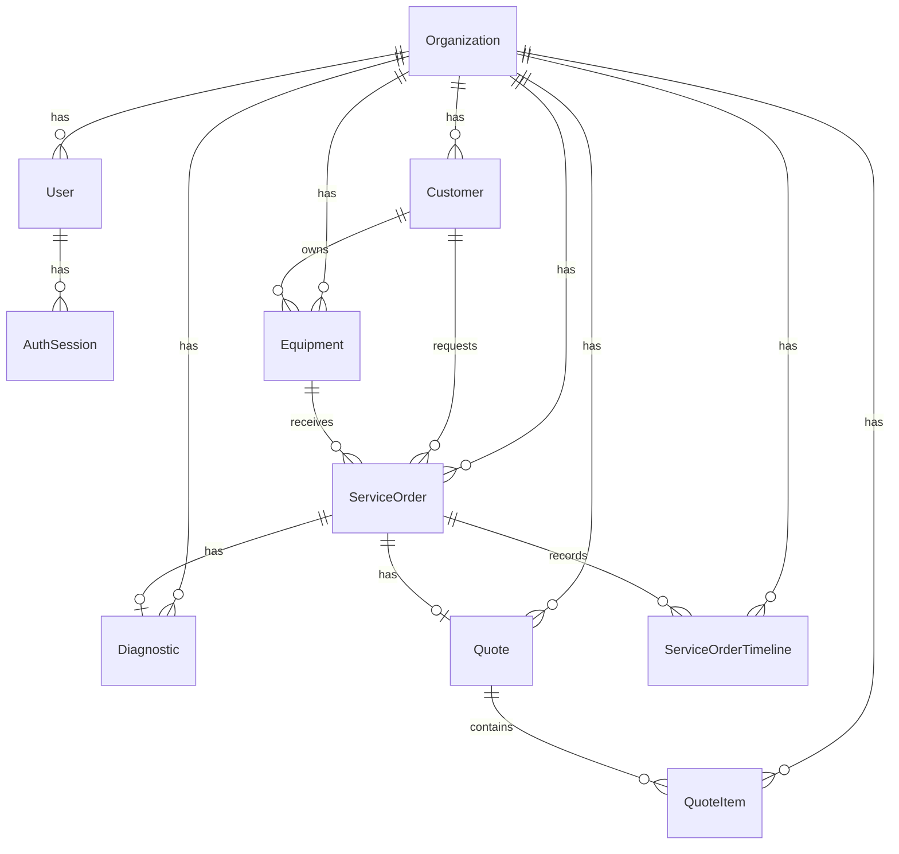

# Database

## Banco

O FixFlow usa PostgreSQL com Prisma ORM. O schema inicial esta em
`prisma/schema.prisma` e a primeira migration em `prisma/migrations`.

## Entidades

- Organization: representa a assistencia tecnica e o tenant.
- User: usuario interno da Organization.
- AuthSession: sessao opaca persistida para um User autenticado.
- Customer: cliente da assistencia.
- Equipment: equipamento vinculado a um cliente.
- ServiceOrder: ordem de servico.
- Diagnostic: diagnostico tecnico de uma ordem de servico.
- Quote: orcamento de uma ordem de servico.
- QuoteItem: item de orcamento.
- ServiceOrderTimeline: evento de historico da ordem de servico.

## Relacionamentos

- Organization possui usuarios, clientes, equipamentos, ordens, diagnosticos,
  orcamentos, itens de orcamento e timeline.
- User possui varias AuthSession.
- Customer possui Equipment e ServiceOrder.
- Equipment pertence a Customer e pode aparecer em varias ServiceOrder.
- ServiceOrder possui no maximo um Diagnostic, no maximo um Quote e varios
  eventos de timeline.
- Quote possui varios QuoteItem.

## Decisoes de modelagem

- IDs internos usam `String @default(cuid())` para evitar sequencias previsiveis.
- Toda entidade de negocio possui `organizationId`.
- Relacionamentos entre entidades de negocio usam chaves compostas com
  `organizationId` quando possivel.
- `User.email` e unico globalmente nesta fase para simplificar autenticacao
  atual. Isso significa que o mesmo email nao pode representar usuarios
  diferentes em Organizations distintas. Um modelo de memberships pode ser
  avaliado se o mesmo usuario precisar
  pertencer a varias Organizations.
- `User.passwordHash` e obrigatorio porque, nesta fase, usuarios internos
  autenticam por senha. OAuth ou provedores externos futuros exigiriam uma
  decisao de modelagem mais ampla.
- `AuthSession` nao possui `organizationId`. Ela pertence ao User, e a
  Organization confiavel e resolvida a partir do User persistido.
- `AuthSession.tokenHash` armazena o hash SHA-256 deterministico do token bruto.
  O token bruto existe apenas no cookie HTTP-only e durante o fluxo de criacao
  ou invalidacao da sessao.
- A expiracao inicial da sessao e fixa em 7 dias a partir da criacao. Nao ha
  sliding expiration nesta fase.
- `Diagnostic` e unico por `ServiceOrder` dentro da Organization.
- `Quote` e unico por `ServiceOrder` dentro da Organization nesta fase.
  Revisoes ou multiplos orcamentos ativos ficam fora do MVP atual.

## Valores monetarios

Valores monetarios nunca usam Float. `QuoteItem.unitPrice` usa
`Decimal @db.Decimal(12, 2)`, armazenado no PostgreSQL como `DECIMAL(12,2)`.
Isso evita erros de arredondamento binario comuns em `Float`.

## Indices

Indices iniciais priorizam:

- busca por Organization;
- busca de clientes por nome dentro da Organization;
- equipamentos de um Customer;
- ordens de uma Organization;
- ordens por Customer, Equipment, status e data;
- timeline de uma ServiceOrder ordenada por criacao;
- quotes por ServiceOrder e status;
- sessoes por User;
- limpeza futura de sessoes por `expiresAt`.

`AuthSession.tokenHash` usa constraint `unique`, que ja cria indice para busca
por tokenHash. Por isso nao ha indice duplicado para o mesmo campo.

## Unicidade

- `Organization.slug` e unico.
- `User.email` e unico globalmente.
- `AuthSession.tokenHash` e unico globalmente.
- `ServiceOrder.publicCode` e unico globalmente.
- `Diagnostic` e unico por `[serviceOrderId, organizationId]`.
- `Quote` e unico por `[serviceOrderId, organizationId]`.
- `Equipment` tem unicidade em `[organizationId, serialNumber]`; PostgreSQL
  permite multiplos `NULL`, entao equipamentos sem serial nao entram em conflito.

## Uso de organizationId

`organizationId` existe em todas as entidades de negocio. Ele deve ser usado em
consultas futuras junto com o ID da entidade. A presenca do campo no banco nao
garante isolamento se o codigo consultar apenas por IDs isolados.

`AuthSession` nao e entidade de negocio de uma assistencia tecnica. Ela nao
recebe `organizationId` diretamente; o contexto da Organization vem do User
autenticado associado a sessao.

## Customer e Equipment na Fase 3

Customer e Equipment pertencem diretamente a Organization. Equipment tambem
pertence a Customer, mas mantem seu proprio `organizationId` para que consultas
de equipamentos sejam filtradas pelo tenant sem depender apenas do relacionamento
com Customer.

A relacao `Equipment.customer` usa os campos compostos
`[customerId, organizationId] -> Customer[id, organizationId]`. Isso evita ou
reduz a possibilidade de associar um Equipment a Customer de outra Organization.
Mesmo assim, a aplicacao valida `customerId` com `context.organizationId` antes
de criar Equipment.

As consultas implementadas nesta fase usam os indices existentes:

- `Customer_organizationId_idx` para escopo por tenant;
- `Customer_organizationId_name_idx` para listagem ordenada e busca por nome;
- `Equipment_organizationId_idx` para escopo por tenant;
- `Equipment_organizationId_customerId_idx` para equipamentos de um Customer;
- `Equipment_organizationId_serialNumber_key` para unicidade de serie dentro da
  Organization.

Nenhuma alteracao de schema ou migration foi necessaria nesta fase.

## ServiceOrder na Fase 4

ServiceOrder passou a ser usada pela aplicacao para abertura, listagem, busca,
filtro por status, detalhes e transicoes controladas.

Ela possui `organizationId`, `customerId` e `equipmentId`. A redundancia de
`customerId + equipmentId` e intencional: a ordem precisa consultar rapidamente
o cliente e o equipamento relacionados, enquanto Equipment continua pertencendo
a Customer.

Na criacao, o browser informa somente `equipmentId` e `reportedIssue`. O service
carrega Equipment por `equipmentId + context.organizationId` e deriva
`ServiceOrder.customerId` de `Equipment.customerId`. O schema reforca que
ServiceOrder.customer e ServiceOrder.equipment pertencem ao mesmo
`organizationId` por relacoes compostas:

- `[customerId, organizationId] -> Customer[id, organizationId]`;
- `[equipmentId, organizationId] -> Equipment[id, organizationId]`.

O schema nao possui uma constraint composta garantindo que
`ServiceOrder.customerId` seja exatamente o Customer proprietario do Equipment.
Nesta fase, esse invariante e garantido pela aplicacao durante a criacao,
somado aos filtros tenant-aware e as constraints compostas existentes.

As consultas implementadas usam os indices existentes:

- `ServiceOrder_organizationId_idx` para escopo por tenant;
- `ServiceOrder_organizationId_customerId_idx` para futuras consultas por
  Customer;
- `ServiceOrder_organizationId_equipmentId_idx` para futuras consultas por
  Equipment;
- `ServiceOrder_organizationId_status_idx` para filtro de status;
- `ServiceOrder_organizationId_createdAt_idx` para ordenacao por abertura;
- `ServiceOrder_publicCode_key` para unicidade global do codigo publico.

Busca de OS usa filtros Prisma sobre `publicCode`, `Customer.name`,
`Equipment.brand`, `Equipment.model` e `Equipment.serialNumber`, sempre com
`organizationId`.

## ServiceOrderTimeline na Fase 4

ServiceOrderTimeline registra eventos server-side da OS. Nesta fase os tipos
usados sao strings centralizadas no dominio:

- `SERVICE_ORDER_CREATED`;
- `STATUS_CHANGED`.

Leituras de timeline usam `organizationId + serviceOrderId` e ordenam por
`createdAt asc` com `id asc` como desempate. Criacoes de timeline sempre forcam
`organizationId` do contexto confiavel.

A criacao da OS e do evento inicial ocorre na mesma transacao Prisma. A mudanca
de status e o evento `STATUS_CHANGED` tambem ocorrem na mesma transacao.

Concorrencia de status usa update otimista sem campo `version`: o update filtra
por `id + organizationId + status atual esperado`. Se nenhuma linha e alterada,
a aplicacao retorna conflito e nao cria timeline.

Nenhuma alteração de schema ou migration foi necessária na Fase 4.

## Diagnostic, Quote e QuoteItem na Fase 5

Diagnostic, Quote e QuoteItem passaram a ser usados pela aplicacao.

Diagnostic pertence a Organization e ServiceOrder por relacao composta
`[serviceOrderId, organizationId] -> ServiceOrder[id, organizationId]`. O banco
mantem unicidade em `[serviceOrderId, organizationId]`, garantindo no maximo um
Diagnostic por OS dentro do tenant.

Quote tambem pertence a Organization e ServiceOrder pela mesma estrategia de
relacao composta. A Fase 5 adicionou unicidade em
`[serviceOrderId, organizationId]`, garantindo no maximo um Quote por OS dentro
do tenant. A migration
`20260711000000_make_quote_unique_per_service_order` criou o indice unique
`Quote_serviceOrderId_organizationId_key`.

QuoteItem pertence a Organization e Quote. Consultas e mutacoes usam
`organizationId` diretamente, e quando o contexto do Quote esta disponivel
tambem filtram por `quoteId`. Itens sao removidos com `deleteMany` filtrando
`id + quoteId + organizationId`, nunca por id isolado.

`QuoteStatus` continua como enum Prisma: `DRAFT`, `SENT`, `APPROVED` e
`REJECTED`.

`QuoteItem.unitPrice` permanece `Decimal @db.Decimal(12, 2)`, armazenado no
PostgreSQL como `DECIMAL(12,2)`. A precisao total e 12 digitos, com escala 2,
permitindo valores positivos ate `9999999999.99`. Subtotal e total sao
derivados no servidor usando `Prisma.Decimal` e retornados em DTOs como strings
canonicas com duas casas.

Nenhum campo `subtotal` ou `total` foi adicionado ao banco nesta fase.

ServiceOrderTimeline passou a registrar tambem:

- `DIAGNOSTIC_RECORDED`;
- `DIAGNOSTIC_UPDATED`;
- `QUOTE_CREATED`;
- `QUOTE_SENT`;
- `QUOTE_APPROVED`;
- `QUOTE_REJECTED`.

Criacao/edicao de Diagnostic, criacao de Quote e transicoes comerciais de Quote
usam transacoes Prisma junto com timeline. Envio/aprovacao/rejeicao atualizam
Quote e ServiceOrder de forma atomica e com concorrencia otimista por status
esperado.

## Estrategia de publicCode

`ServiceOrder.publicCode` e usado para acompanhamento publico da OS e ja e
gerado na abertura de ordens. Ele nao deve ser ID incremental nem derivado do ID
interno. A estrategia atual gera um codigo com prefixo `FF-` e 10 caracteres
aleatorios usando alfabeto sem caracteres ambiguos.

Exemplo conceitual: `FF-7KQ4M2X9AB`.

O campo e unico globalmente. Em caso raro de colisao especifica em
`publicCode`, o service gera novo codigo e tenta novamente ate 5 vezes. P2002
nao relacionado a `publicCode` nao e tratado como colisao.

Na Fase 6, `/track/[publicCode]` consulta ServiceOrder por esse campo usando
DTO publico minimo. Nenhuma alteracao de schema foi necessaria para o portal
publico.

## Diagrama ER simplificado

## Migration de autenticacao

A migration `20260709180000_add_authentication` adiciona:

- coluna obrigatoria `User.passwordHash`;
- tabela `AuthSession`;
- unique em `AuthSession.tokenHash`;
- indice em `AuthSession.userId`;
- indice em `AuthSession.expiresAt`;
- foreign key `AuthSession.userId -> User.id` com `ON DELETE CASCADE`.

Como o projeto ainda esta na fundacao e nao possui usuarios reais previstos, a
coluna `passwordHash` foi adicionada como obrigatoria sem default. Em bancos com
usuarios existentes, essa migration exigiria um plano de preenchimento dos
hashes antes de aplicar a constraint.

## Riscos e decisoes futuras

- Avaliar Row Level Security quando houver autenticacao e contexto de tenant.
- Definir politica de retencao e auditoria de alteracoes.
- Avaliar se `User.email` deve continuar global ou migrar para um modelo de
  identidade + memberships.
- Definir limpeza periodica de sessoes expiradas.
- Criar testes de integracao para constraints de tenant quando o banco estiver
  disponivel em CI.
