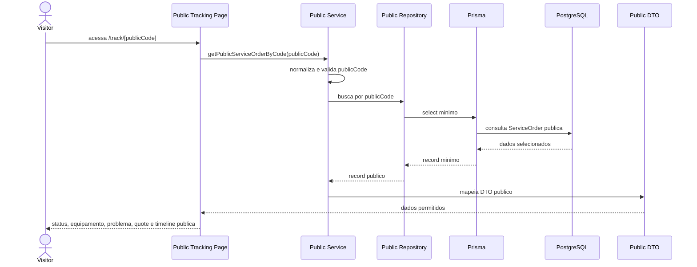
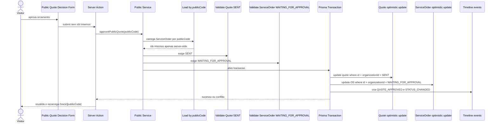

# Public Portal

## Objetivo

O portal publico permite que um visitante acompanhe uma unica ordem de servico
por `publicCode`, sem login administrativo. O acesso e limitado, explicito e
nao substitui autenticacao interna.

A rota publica implementada e:

```text
/track/[publicCode]
```

Essa rota nao usa o layout protegido de `/app`, nao chama
`AuthenticatedContext`, nao mostra navegacao administrativa e nao permite
listar ordens.

## PublicCode

`ServiceOrder.publicCode` e um codigo globalmente unico, nao sequencial, com o
formato `FF-XXXXXXXXXX`. Ele funciona como link de acompanhamento da OS, mas nao
da acesso administrativo.

Antes de qualquer consulta publica, o codigo e:

- convertido com `trim`;
- normalizado para uppercase;
- validado no formato exato;
- rejeitado quando e longo demais ou contem caracteres inesperados.

Codigo invalido e tratado como ordem nao encontrada. Nao existe fallback para ID
interno.

## Dados exibidos

O DTO publico retorna somente:

- `publicCode`;
- status e label em portugues;
- problema relatado;
- datas de criacao e atualizacao;
- equipamento com tipo, marca e modelo;
- quote publico quando estiver em `SENT`, `APPROVED` ou `REJECTED`;
- timeline publica mapeada por evento.

O numero de serie do equipamento nao e exibido nesta fase.

## Dados proibidos

O portal publico nao retorna:

- `organizationId`;
- IDs internos de ServiceOrder, Customer, Equipment, Quote ou QuoteItem;
- dados de Customer;
- email, telefone ou documento;
- `userId`, role, token, `tokenHash` ou `passwordHash`;
- `Diagnostic.description` ou `technicalNotes`;
- descricoes internas de timeline;
- objetos Prisma completos.

Esses dados nao sao enviados como props para Client Components.

## DTO publico

O DTO publico e separado dos DTOs internos:

```ts
type PublicServiceOrderDetailsDto = {
  publicCode: string;
  status: ServiceOrderStatus;
  statusLabel: string;
  reportedIssue: string;
  createdAt: Date;
  updatedAt: Date;
  equipment: {
    type: string;
    typeLabel: string;
    brand: string;
    model: string;
  };
  quote: PublicQuoteDto | null;
  timeline: PublicTimelineEventDto[];
};
```

`PublicQuoteDto` usa strings canonicas para dinheiro (`unitPrice`, `subtotal` e
`total`). A UI apenas formata essas strings para BRL.

## Timeline publica

A timeline publica nao reaproveita descricoes internas. O service gera mensagens
seguras a partir do tipo do evento:

- `SERVICE_ORDER_CREATED`: "Ordem de servico registrada."
- `STATUS_CHANGED`: "Status da ordem de servico atualizado."
- `DIAGNOSTIC_RECORDED`: "Diagnostico tecnico registrado."
- `DIAGNOSTIC_UPDATED`: "Diagnostico tecnico atualizado."
- `QUOTE_CREATED`: oculto.
- `QUOTE_SENT`: "Orcamento disponibilizado para analise."
- `QUOTE_APPROVED`: "Orcamento aprovado."
- `QUOTE_REJECTED`: "Orcamento rejeitado."

## Orcamento publico

Quote aparece publicamente somente quando seu status e:

- `SENT`;
- `APPROVED`;
- `REJECTED`.

Quote `DRAFT` e interno e aparece ao visitante como orcamento ainda nao
disponivel.

## Aprovacao e rejeicao publica

O visitante pode decidir o orcamento somente quando:

- `publicCode` e valido;
- ServiceOrder existe;
- Quote existe;
- Quote esta em `SENT`;
- ServiceOrder esta em `WAITING_FOR_APPROVAL`.

Aprovacao publica altera atomicamente:

- Quote: `SENT -> APPROVED`;
- ServiceOrder: `WAITING_FOR_APPROVAL -> APPROVED`;
- timeline: `QUOTE_APPROVED` e `STATUS_CHANGED`.

Rejeicao publica altera atomicamente:

- Quote: `SENT -> REJECTED`;
- ServiceOrder: `WAITING_FOR_APPROVAL -> CANCELLED`;
- timeline: `QUOTE_REJECTED` e `STATUS_CHANGED`.

O fluxo interno por OWNER/ADMIN continua existindo. Os dois caminhos respeitam
os mesmos invariantes de status, transacao, concorrencia e timeline.

## Atomicidade e concorrencia

A decisao publica usa transacao Prisma. O update de Quote filtra por status
esperado `SENT`, e o update de ServiceOrder filtra por status esperado
`WAITING_FOR_APPROVAL`.

Se qualquer update condicional afetar zero linhas, a operacao retorna conflito
seguro e a transacao nao cria timeline parcial. A mensagem publica e:

```text
Este orcamento ja foi atualizado. Recarregue a pagina para ver o estado atual.
```

## Fluxo de consulta publica



## Fluxo de aprovacao publica



## Server Actions publicas

As actions publicas ficam na rota `/track/[publicCode]` e:

- nao chamam `requireAuthenticatedContext`;
- nao aceitam `organizationId`;
- nao aceitam `serviceOrderId`;
- nao aceitam `quoteId`;
- nao aceitam status atual;
- nao aceitam total;
- chamam apenas o service publico com `publicCode`;
- traduzem erros para mensagens publicas seguras;
- revalidam e recarregam a pagina publica apos sucesso.

## Limitacoes

Nesta fase nao ha:

- login de cliente;
- envio automatico de email, WhatsApp ou SMS;
- PDF;
- assinatura digital;
- pagamento;
- upload;
- comentarios publicos;
- rate limiting distribuido ou CAPTCHA.

## Evolucoes futuras

Evolucoes naturais sao proposta/PDF, envio externo do link por processo
controlado, observabilidade, rate limiting e melhorias de implantacao. Essas
evolucoes nao foram simuladas nesta fase.
