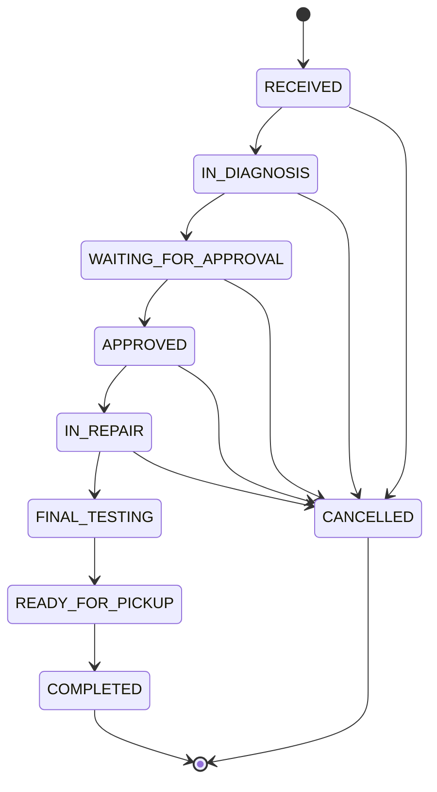

# Service order workflow

## Objetivo

O workflow de ordem de servico define transicoes permitidas entre status. Mudancas
arbitrarias de status nao devem ser permitidas futuramente. A validacao deve
ocorrer na camada de dominio ou service de aplicacao, e nao apenas na interface.

## Fluxo principal

## Transicoes permitidas

| Status atual | Proximo status permitido | Significado da transicao |
| --- | --- | --- |
| RECEIVED | IN_DIAGNOSIS | Equipamento recebido e encaminhado para diagnostico tecnico. |
| RECEIVED | CANCELLED | Atendimento cancelado antes do inicio do diagnostico. |
| IN_DIAGNOSIS | WAITING_FOR_APPROVAL | Diagnostico concluido e orcamento aguardando decisao do cliente. |
| IN_DIAGNOSIS | CANCELLED | Atendimento cancelado durante diagnostico, antes de aprovacao. |
| WAITING_FOR_APPROVAL | APPROVED | Cliente aprovou o orcamento. |
| WAITING_FOR_APPROVAL | CANCELLED | Cliente rejeitou ou cancelou antes do reparo. |
| APPROVED | IN_REPAIR | Reparo iniciado apos aprovacao. |
| APPROVED | CANCELLED | Cancelamento excepcional antes do inicio do reparo. |
| IN_REPAIR | FINAL_TESTING | Reparo concluido e equipamento enviado para testes finais. |
| IN_REPAIR | CANCELLED | Cancelamento excepcional durante manutencao, antes da conclusao tecnica. |
| FINAL_TESTING | READY_FOR_PICKUP | Testes finais aprovados e equipamento liberado para retirada. |
| READY_FOR_PICKUP | COMPLETED | Cliente retirou ou recebeu o equipamento. |
| COMPLETED | nenhum | Estado final. |
| CANCELLED | nenhum | Estado final. |

## Decisao sobre cancelamento

`CANCELLED` e permitido ate `IN_REPAIR`, porque ainda pode haver casos reais em
que o cliente desiste, a assistencia interrompe o atendimento ou o reparo se
torna inviavel. A partir de `FINAL_TESTING`, o servico ja foi tecnicamente
executado; por isso o fluxo deve seguir para liberacao e conclusao, com ajustes
financeiros ou administrativos tratados por outras regras futuras.
