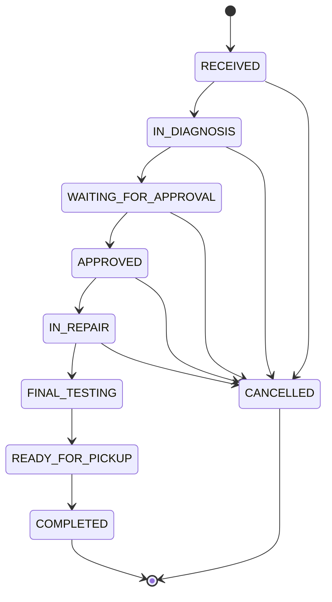

# Service order workflow

## Objetivo

O workflow de ordem de servico define as transicoes permitidas entre status. A
regra vive em `src/domain/services/service-order-workflow.ts` e e revalidada no
server-side durante cada mudanca de status.

A interface exibe apenas acoes permitidas, mas ela nao e a fonte de seguranca.
O service sempre carrega o status atual persistido e valida a transicao no
dominio.

## Fluxo principal

## Transicoes permitidas

| Status atual | Proximo status permitido | Significado da transicao |
| --- | --- | --- |
| RECEIVED | IN_DIAGNOSIS | Equipamento recebido e encaminhado para diagnostico tecnico. |
| RECEIVED | CANCELLED | Atendimento cancelado antes do inicio do diagnostico. |
| IN_DIAGNOSIS | WAITING_FOR_APPROVAL | Orcamento enviado logicamente pelo fluxo de Quote e aguardando decisao do cliente. |
| IN_DIAGNOSIS | CANCELLED | Atendimento cancelado durante diagnostico, antes de aprovacao. |
| WAITING_FOR_APPROVAL | APPROVED | Aprovacao interna do Quote registrada por usuario autorizado. |
| WAITING_FOR_APPROVAL | CANCELLED | Cliente rejeitou ou cancelou antes do reparo. |
| APPROVED | IN_REPAIR | Reparo iniciado apos aprovacao. |
| APPROVED | CANCELLED | Cancelamento excepcional antes do inicio do reparo. |
| IN_REPAIR | FINAL_TESTING | Reparo concluido e equipamento enviado para testes finais. |
| IN_REPAIR | CANCELLED | Cancelamento excepcional durante manutencao, antes da conclusao tecnica. |
| FINAL_TESTING | READY_FOR_PICKUP | Testes finais aprovados e equipamento liberado para retirada. |
| READY_FOR_PICKUP | COMPLETED | Cliente retirou ou recebeu o equipamento. |
| COMPLETED | nenhum | Estado terminal. |
| CANCELLED | nenhum | Estado terminal. |

Transicoes para o mesmo status tambem sao rejeitadas.

## Cancelamento

`CANCELLED` e permitido ate `IN_REPAIR`, porque ainda pode haver casos reais em
que o cliente desiste, a assistencia interrompe o atendimento ou o reparo se
torna inviavel. A partir de `FINAL_TESTING`, o servico ja foi tecnicamente
executado; por isso o fluxo deve seguir para liberacao e conclusao, com ajustes
financeiros ou administrativos tratados por regras futuras.

OWNER e ADMIN podem cancelar quando o workflow permite. TECHNICIAN nao pode
cancelar, mesmo que invoque a Server Action diretamente.

## Pre-condicoes comerciais da Fase 5

A regra estrutural de dominio continua reconhecendo
`IN_DIAGNOSIS -> WAITING_FOR_APPROVAL` e
`WAITING_FOR_APPROVAL -> APPROVED` como parte do workflow. Entretanto, a
application layer bloqueia essas transicoes pelo service generico de
ServiceOrder.

`IN_DIAGNOSIS -> WAITING_FOR_APPROVAL` ocorre somente atraves do envio logico de
Quote `DRAFT -> SENT`, com:

- Diagnostic existente;
- pelo menos 1 item;
- total recalculado maior que zero;
- usuario `OWNER` ou `ADMIN`.

`WAITING_FOR_APPROVAL -> APPROVED` ocorre somente atraves do registro interno de
aprovacao de Quote `SENT -> APPROVED`, tambem restrito a `OWNER` ou `ADMIN`.

Rejeicao de Quote e um fluxo comercial separado: Quote `SENT -> REJECTED` altera
a ServiceOrder de `WAITING_FOR_APPROVAL` para `CANCELLED` na mesma transacao.
Essa decisao encerra a OS no MVP da Fase 5.

Ao tentar usar a transicao generica para os caminhos especializados, o service
retorna erro controlado orientando o usuario a enviar ou aprovar o orcamento.

## Timeline

A abertura cria um evento `SERVICE_ORDER_CREATED`. Toda transicao valida cria
um evento `STATUS_CHANGED` com descricao gerada server-side a partir dos labels
de status.

Diagnostic e Quote adicionam eventos operacionais na mesma timeline consolidada:

- `DIAGNOSTIC_RECORDED`;
- `DIAGNOSTIC_UPDATED`;
- `QUOTE_CREATED`;
- `QUOTE_SENT`;
- `QUOTE_APPROVED`;
- `QUOTE_REJECTED`.

O browser nao envia `type` nem `description` da timeline.

## Concorrencia

A transicao usa concorrencia otimista simples. Depois de carregar o status
persistido, o repository atualiza usando filtro por:

- `id`;
- `organizationId`;
- `status` atual esperado.

Se nenhuma linha for alterada, a operacao retorna `ConflictError` e nenhuma
timeline de status e criada.

Fluxos comerciais de Quote aplicam a mesma estrategia para Quote e ServiceOrder
na mesma transacao. Se o status esperado de qualquer um mudar antes do update,
a operacao retorna `ConflictError` e nenhuma timeline comercial e criada.
