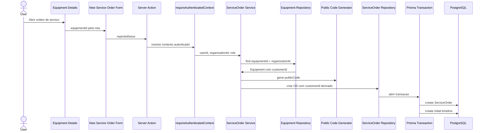

# Service Orders

## Objetivo

ServiceOrder representa a ordem de servico operacional do FixFlow. Nesta fase,
ela cobre abertura, listagem, busca, filtro por status, detalhes, timeline
inicial e transicoes de status controladas pelo workflow.

Diagnostic, Quote, portal publico, PDF e integracoes continuam fora do escopo
implementado.

## Relacao com Customer e Equipment

Uma ServiceOrder pertence a uma Organization, a um Customer e a um Equipment.
O browser nao escolhe `customerId` durante a abertura.

O fluxo confiavel e:

1. a rota ou formulario informa `equipmentId`;
2. o servidor resolve `AuthenticatedContext`;
3. o service carrega Equipment por `equipmentId + context.organizationId`;
4. `customerId` e derivado do Equipment persistido;
5. o repository cria ServiceOrder com `organizationId` do contexto.

Esse desenho impede que o browser combine um Customer de um tenant com um
Equipment de outro tenant.

## Abertura de OS

A abertura recebe somente:

- `equipmentId`;
- `reportedIssue`.

`reportedIssue` e validado no dominio com trim, minimo de 5 caracteres e maximo
de 2000 caracteres. Campos como `organizationId`, `customerId`, `publicCode`,
`status` e timeline nao fazem parte do input publico.

Toda nova OS inicia com status `RECEIVED`.



## PublicCode

`publicCode` usa o gerador existente `FF-XXXXXXXXXX`, com caracteres aleatorios
gerados server-side por `crypto.randomInt`. Ele nao e incremental e nao deriva
de `ServiceOrder.id`, `customerId`, `equipmentId` ou timestamp.

O banco mantem `ServiceOrder.publicCode` como unique. Se a criacao encontrar
uma colisao especifica de `publicCode`, o service gera outro codigo e tenta
novamente. O limite e `SERVICE_ORDER_PUBLIC_CODE_MAX_ATTEMPTS = 5`.

P2002 nao relacionado a `publicCode` nao e tratado como colisao e e propagado
como erro inesperado. A UI nao recebe detalhes Prisma.

## Workflow

O workflow fica em `src/domain/services/service-order-workflow.ts`. A UI exibe
somente transicoes permitidas a partir do status atual, mas o servidor sempre
revalida a transicao.

Fluxo principal:

RECEIVED -> IN_DIAGNOSIS -> WAITING_FOR_APPROVAL -> APPROVED -> IN_REPAIR ->
FINAL_TESTING -> READY_FOR_PICKUP -> COMPLETED

`CANCELLED` e terminal. `COMPLETED` tambem e terminal.

Nesta fase o workflow valida a estrutura das transicoes. Ele ainda nao exige
Diagnostic ou Quote existentes, porque essas funcionalidades serao implementadas
em fases futuras.

## Cancelamento e autorizacao

OWNER e ADMIN podem cancelar quando o workflow permite.

TECHNICIAN pode listar, visualizar, criar OS e executar transicoes operacionais,
mas nao pode cancelar. Essa regra e aplicada no service server-side com a role
do `AuthenticatedContext`; esconder o botao na UI nao e a protecao principal.

## Timeline

A timeline e gerada pelo servidor. Nesta fase existem eventos:

- `SERVICE_ORDER_CREATED`;
- `STATUS_CHANGED`.

A abertura cria o primeiro evento com a OS. Cada transicao de status cria um
evento com descricao derivada dos labels de status em portugues. O browser nao
envia `type` nem `description` da timeline.

## Atomicidade

A criacao de ServiceOrder e do evento inicial ocorre em uma transacao Prisma no
repository. O resultado permitido e OS + timeline inicial, ou nenhuma escrita.

A transicao de status e o evento `STATUS_CHANGED` tambem ocorrem na mesma
transacao. Nao ha fluxo conhecido em que status mude sem timeline ou timeline
seja criada sem a mudanca de status.

## Concorrencia otimista

A transicao usa o status persistido como status esperado. O repository executa
`updateMany` com filtro por:

- `id`;
- `organizationId`;
- `status` atual lido do banco.

Se a contagem de linhas alteradas for zero, o service retorna `ConflictError`
com mensagem segura. Nesse caso, a timeline de status nao e criada.

```mermaid
sequenceDiagram
  actor User
  participant Details as Service Order Details
  participant Action as Transition Action
  participant Context as requireAuthenticatedContext
  participant Service as ServiceOrder Service
  participant Repo as ServiceOrder Repository
  participant Workflow as Domain Workflow
  participant Tx as Prisma Transaction
  participant DB as PostgreSQL

  User->>Details: acao de status
  Details->>Action: serviceOrderId + targetStatus
  Action->>Context: resolve contexto autenticado
  Context->>Service: userId, organizationId, role
  Service->>Repo: carregar status atual por id + organizationId
  Repo->>Service: status persistido
  Service->>Workflow: validar current -> target
  Service->>Service: validar role se target=CANCELLED
  Service->>Repo: transicionar com status esperado
  Repo->>Tx: abrir transacao
  Tx->>DB: optimistic status update
  Tx->>DB: create timeline event
```

## Tenant isolation

Todas as operacoes internas usam `context.organizationId`.

- listagem e contagem filtram por Organization;
- detalhes filtram por `id + organizationId`;
- timeline de detalhes filtra por `organizationId`;
- criacao força `organizationId` do contexto;
- Equipment de abertura e carregado por `equipmentId + organizationId`;
- transicao filtra por `id + organizationId + status esperado`.

Cross-tenant se comporta como recurso nao encontrado.

## Busca, filtro e paginacao

A listagem usa pagina baseada em numero com tamanho fixo de 20 registros. O
browser nao escolhe page size.

Busca server-side considera:

- `publicCode`;
- `Customer.name`;
- `Equipment.brand`;
- `Equipment.model`;
- `Equipment.serialNumber`.

O filtro de status e separado e validado contra `ServiceOrderStatus` antes de
chegar ao Prisma.

## DTOs

Services retornam DTOs especificos para lista e detalhe. Eles nao expõem
`organizationId`, `passwordHash`, `tokenHash`, token bruto ou objetos Prisma
inteiros.

## Limitacoes atuais

- nao ha Diagnostic funcional;
- nao ha Quote ou QuoteItem funcional;
- nao ha pre-condicoes de orcamento no workflow;
- nao ha portal publico por `publicCode`;
- nao ha PDF, email, WhatsApp, anexos ou IA;
- rollback real em PostgreSQL nao foi validado neste ambiente sem Docker.
